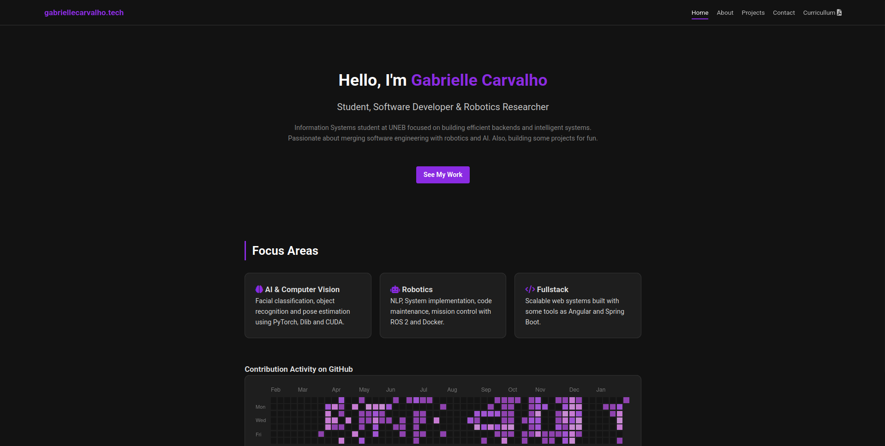

# Portfolio | Developer & Researcher
> A minimalist, responsive portfolio designed to showcase projects in Artificial Intelligence, Robotics, and Fullstack Development.



## 🌐 Live Demo
👉 **[Access the Portfolio Online](https://gabrielle-carvalho.github.io/gabrielle-carvalho.github.io)**

## 📖 About
This project is a personal portfolio website built to highlight my academic research at **UNEB** and my technical projects.
The site is built with pure **HTML/CSS/JS** to ensure high performance and zero dependencies, using a component-based architecture for the Header and Footer via JavaScript.

## ✨ Features

- **Dynamic Loading:** Header and Footer are loaded via JavaScript (`fetch`) to maintain a DRY (Don't Repeat Yourself) code structure.
- **Responsive Design:** Fully adapted for Desktop, Tablet, and Mobile.
- **PDF Viewer:** Embedded PDF viewer for the Resume page with fallback for download.
- **Categorized Projects:** distinct sections for AI/ML, Robotics, Fullstack, and Academic Research.
- **Dark UI:** Custom dark theme with high contrast and neon purple highlights.

## 🛠 Technologies Used

    

## 📂 Project Structure

```bash
/
├── assets/             # Images, PDFs...
├── components/         # Reusable HTML snippets
│   ├── header.html
│   └── footer.html
├── js/                 # Logic scripts
│   └── loader.js       # Handles component injection and active menu states
├── index.html          # Homepage
├── about.html          # Bio and Skills page
├── projects.html       # Projects Showcase
├── cv.html             # Resume Viewer
├── style.css
└── README.md
